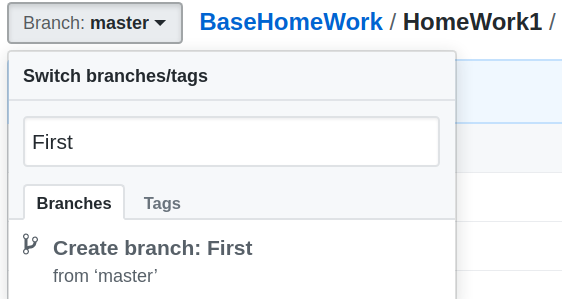
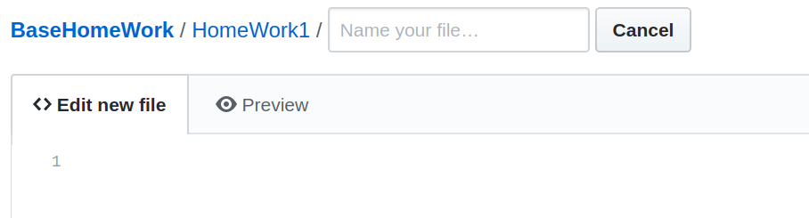
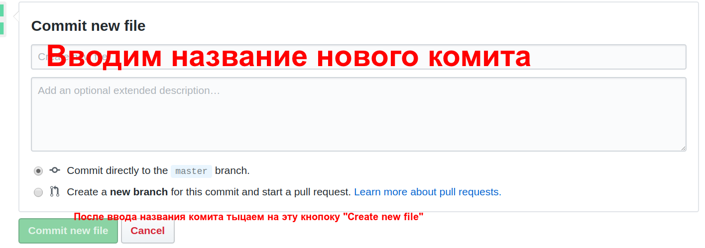
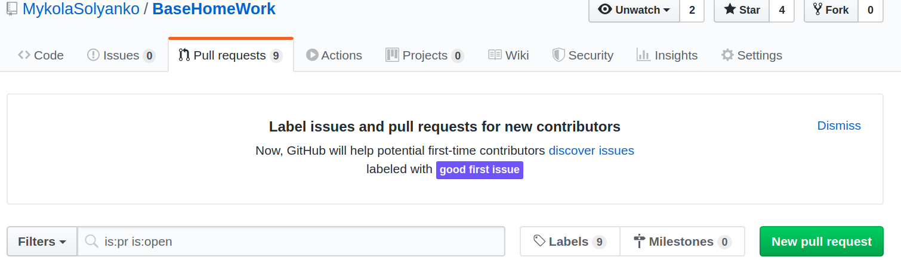

Ниже пример как добавлять домашнее задание на github репозитория **BaseHomeWork**. Пример будет расмотрен в рамках 1й домашней работы
1. Зайти на репозиторий https://github.com/MykolaSolyanko/BaseHomeWork. **Важно чтобы текущая ветка(branch) была master**
2. Дальше создаем свою ветку. В раскрывающемся списке там где написана ветка **master**, поле ввода вводим название новой ветки. Правило для ввода новой ветки имя_фамилия_номер_домашнегозадания все писать на английском языке. Дальше нажимаем **Create branch**. Смотри картинку 1.

3. Потом заходим в директорию соответсвующей номеру домашней работы, в нашем случае это **HomeWork1**.
4. Дальше находясь в директории **HomeWork1** нажимаем на кнопку **Create new file**
5. Дальше в поле ввода водим имя файла который мы хотим добавить в директорию. Правила ввода имени такие же как и для имени ветки и нажимаем Enter. Смотри картинку 2.

6. Дальше в **Edit new file** вставляем отформатированный исходный код нашего домашнего задания, предварительно отформатировав его в (https://zed0.co.uk/clang-format-configurator/).
7. Дальше ниже в этом же окне там где **Commit new file** в первом поле вводим название коммита, типа такого формата `имя фамилия номер домашнего задания или номер задания(если для решения домашней работы было использовано несколько cpp файлов)`. Смотри картинку 3.

8. Дальше после ввода названия комита необходимо нажать на кнопку **Commit new file** Смотри картинку 3
9. Все теперь ваш файл успешно добавлен в вашу ветку на репозитории **BaseHomeWork**.
10. Последний шаг это сделать **Pull Request** c вашей ветки на ветку **master**. Для этого необходимо выбрать вкладку **Pull Request**. Дальше на этой вкладке нажимаем кнопку  **New Pull Request**. Смотри картинку 4.

11. В появившемся окне выбираем там где **compare** нашу ветку и нажимаем **Create new pull request**

И все!!!